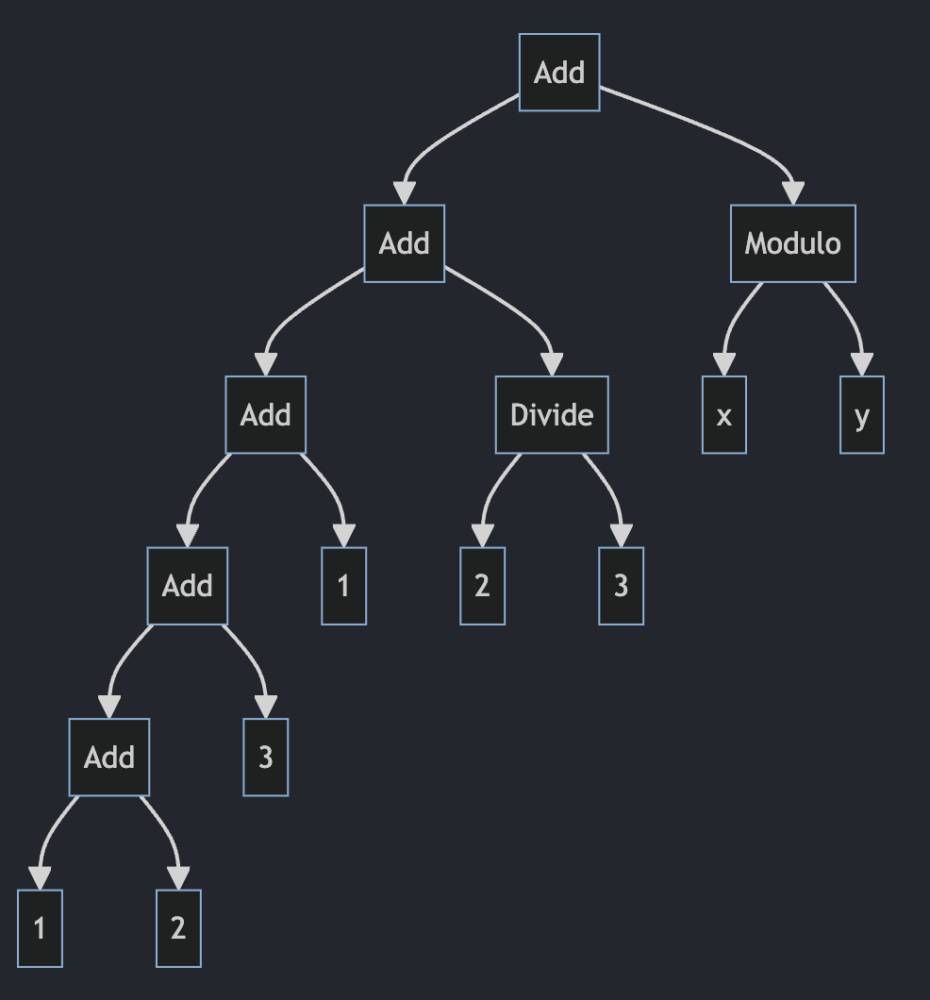

<div>
    <p align="center"></p>
    <h1 align="center">nino-lang</h1>
</div>

[](https://github.com/ridulfo/nino-lang/actions/workflows/on-main.yaml)

**Minimal functional programming language**

*(Development is currently on hold)*

Like the [Whippet](https://en.wikipedia.org/wiki/Whippet), this language [will have] the highest running speed of any [language] of its [size].

The goal is to create a small language that only has the essential features needed to be able to do pretty much anything. No bloat. This will make [self-hosting](<https://en.wikipedia.org/wiki/Self-hosting_(compilers)>) easier and faster.

In this spirit, the under the hood type system is minimal. There are only 5 types:

- `num` - 64 bit floating point number - this is used for numbers
- `char` - 8 bit number - used to represent characters
- `bool` - used to represent true and false
- `fn` - functions are first-class citizens, this is their type
- `array` - an array of any type (even arrays)

The language is chill with side effects. There is no need to wrap anything in monads.

At the moment the language is interpreted, but the goal is to create a self-hosting compiler. TBD whether to compile directly to assembly, [LLVM IR](https://en.wikipedia.org/wiki/LLVM#Intermediate_representation) or [QBE IL](https://c9x.me/compile/). There is no garbage collector at the moment (TBD 🤨).

Finally, here is a blog-post about some design decisions: [Designing a functional programming language](https://nicolo.se/blog/2023-11-13-designing-a-programming-language/).

## Quick start

**Compile the interpreter**

```bash
cargo build --release && mv target/release/ninoi .
```

**Run a example program**

```bash
./ninoi examples/is-prime.ni
```

<details>
    <summary>Output</summary>
    <pre>
Let's calculate primes!
10000019
10000079
10000103
10000121
10000139
10000141
10000169
10000189
Time in milliseconds:
47
    </pre>
</details>

More examples can be found in [/examples](/examples)!

### Bonus

There is an expression-to-AST-diagram program too!

```bash
cargo run --bin mermaid "1+2+3 + 1+2/3 + x mod y" > mermaid.md
```

<details>
    <summary>Output</summary>
    View this using a mermaid viewer.
    
</details>

## Documentation

Documentation can be found in the [docs](docs/).

There you can find the [language specification (WIP)](docs/language-specification.md) and the [grammar specification](docs/grammar.md).

### Examples

```rust
let is_prime_helper:fn = (x:num, i:num):bool => true ? {
    x==i => true,
    x mod i == 0 => false,
    is_prime_helper(x, i + 1)
};

let is_prime:fn = (x:num):bool => x ? {
    1 => false,
    2 => true,
    is_prime_helper(x, 2)
};

print(is_prime(2));
print(is_prime(3));
print(is_prime(4));
print(is_prime(5));
print(is_prime(6));
print(is_prime(7));
```

## Progress

<details>
    <summary>Click to expand</summary>
    <ul>
<li>2023-10-13: Just finished defining the initial complete syntax. Next is to rewrite the lexer, parser and code generator to support the new syntax.</li>
<li>2023-10-15: Syntax has been reworked and a grammar definition can be found in [docs](docs/grammar.md). The lexer has been updated to support the new syntax and the parser has been completely rewritten as a recursive descent parser. A code generated has been implemented that can generate LLVM IR. The next steps are to implement more language features. See [milestones](#milestones) for more details.</li>
<li>2023-10-17: Created compiler program</li>
<li>2023-10-22: Implemented declaring and calling functions. Function calls can be used as values in an expression. The next steps will need to be refactoring and adding unit tests.</li>
<li>2023-10-28: Re-wrote the lexer and parser to rust. Added tons of unit tests. Created an interpreter to run `.ni` files.</li>
<li>2023-10-29: Any programming language's most important features is correctness and safety. No need for more justification.</li>
<li>2023-10-04: Added tail-call optimization. More complex computations are now possible.</li>
<li>2024-01-13: Simplified type system to only have 5 types.</li>
<li>2024-01-14: Finished expression-to-AST-diagram, added more tests, added more support for arrays and improved printing.</li>
<li>2024-02-12: Interpreter now keeps symbols in [scoped-symbols](src/scoped_symbols.rs) leading to a 10x speed improvement compared to the initial symbol table.</li>
<li>2024-05-21: The parser has been refactored to use Results, allowing for some basic error reporting during parsing. A lot of unit and end to end tests have been added in order to ensure the correctness. <br><b>I will take a break from this project (in order to focus on other projects) and may come back to it in the future.</b></li>
</ul>
</details>

## Milestones

- [x] Define complete syntax
- [x] numbers
- [x] characters
- [x] booleans
- [x] function declaration and call
- [x] arrays and strings
- [ ] built-in functions
  - [x] print
  - [x] matching
  - [ ] map
  - [ ] filter
  - [ ] reduce
- [ ] importing
- [ ] anonymous functions
- [ ] self-host compiler
- [ ] [**SOLVE ADVENT OF CODE**](https://time-since.nicolo.io/#/20231201-000000?title=Advent+of+code)

## Tests

In order to run the tests, simply run:

```bash
cargo test
```

## Limitations

What is this it, and what is it not?
The goal is not to create the next big language that everybody should use. This is more of an experiment in making a minimal compiled functional programming language.

I will work on this in my spare time. No guarantees can be made.

## Misc

### C Compiler

The initial version of this language was written in C. This code has now been removed from the main branch, but can be found [here](https://github.com/ridulfo/nino-lang/tree/45b15230d315ffd4185f1ecd626909a32f547704).
